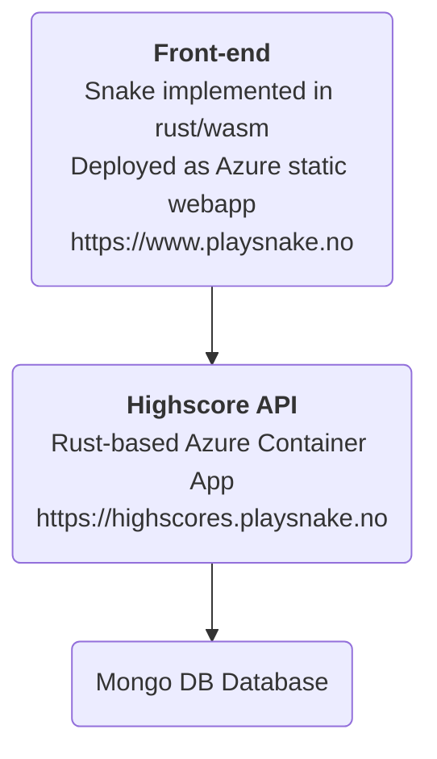

# snake

Snake with optional vim navigation.
Visit [playsnake.no](https://www.playsnake.no) to play!


## Architecture 🏗



All the cloud infra is Infrastructure-as-Code managed by Terraform.

~The highscores API is documented with OpenApi. [Swagger UI](https://highscores.playsnake.no/api/swagger/ui) |
[json](https://highscores.playsnake.no/api/swagger.json) | [yaml](https://highscores.playsnake.no/api/swagger.yaml).~

## Development 🐳

Run all services with docker compose, from the root folder in the repository.

```console
docker compose up -d --build
```

Requires enabling [buildkit](https://docs.docker.com/develop/develop-images/build_enhancements/),
but this is enabled by default in newer versions of docker desktop, so you're probably all set :smile:


Open up front-end at [localhost:8080](http://localhost:8080).
The back-end is available at [localhost:3000](http://localhost:3000).

To stop all services and remove their containers:

```console
docker compose down
```

### Required Tools

[docker](https://www.docker.com/) and [compose](https://github.com/docker/compose)
(incuded in Docker Desktop)
