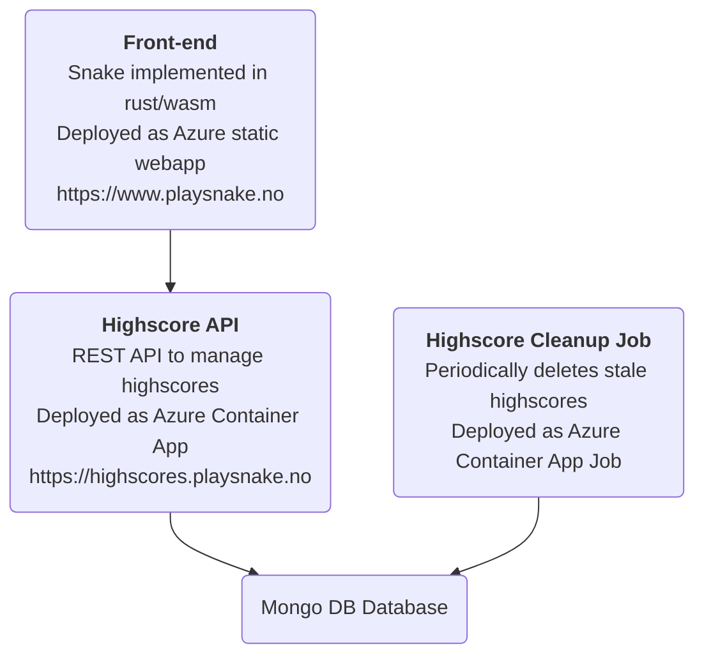

# snake

Snake with optional vim navigation.
Visit [playsnake.no](https://www.playsnake.no) to play!


## Architecture 🏗



All the cloud infra is Infrastructure-as-Code managed by Terraform.

~The highscores API is documented with OpenApi. [Swagger UI](https://highscores.playsnake.no/api/swagger/ui) |
[json](https://highscores.playsnake.no/api/swagger.json) | [yaml](https://highscores.playsnake.no/api/swagger.yaml).~

## Development 🐳

Run all services with docker compose, from the root folder in the repository.

```console
docker compose up -d --build
```

Requires enabling [buildkit](https://docs.docker.com/develop/develop-images/build_enhancements/),
but this is enabled by default in newer versions of docker desktop, so you're probably all set :smile:


Open up front-end at [localhost:8080](http://localhost:8080).
The back-end is available at [localhost:3000](http://localhost:3000).

To stop all services and remove their containers:

```console
docker compose down
```

### Required Tools

[docker](https://www.docker.com/) and [compose](https://github.com/docker/compose)
(incuded in Docker Desktop)

## Monitoring

### Application Insights

Query the `ContainerAppConsoleLogs_CL` and `ContainerAppSystemLogs_CL` tables
to find pod logs and system logs.

### Open Telemetry

The backend service(s) are set up to collect logs using Open Telemetry.
Currently (July, 2023) the open telemetry data is not exported anywhere,
so it is hard to visualize this data. It is printed to the console (see above for finding console logs in application insights). 
//TODO: Make this work smoothly :smile:

